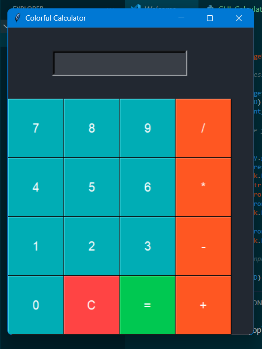
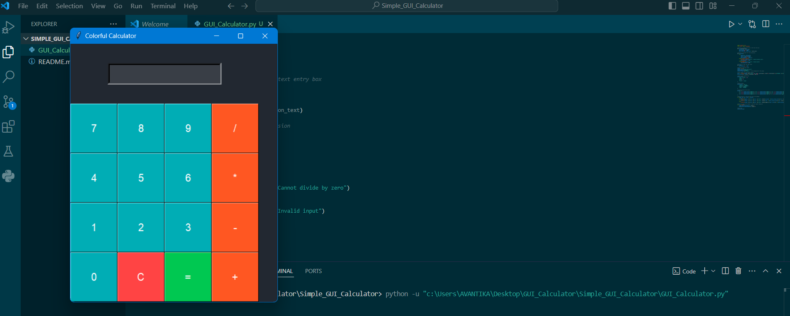
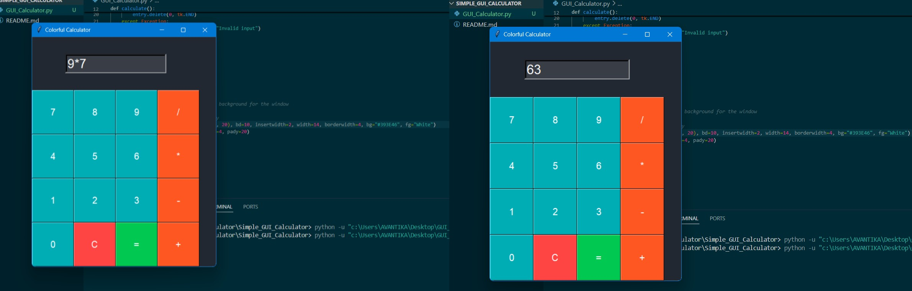
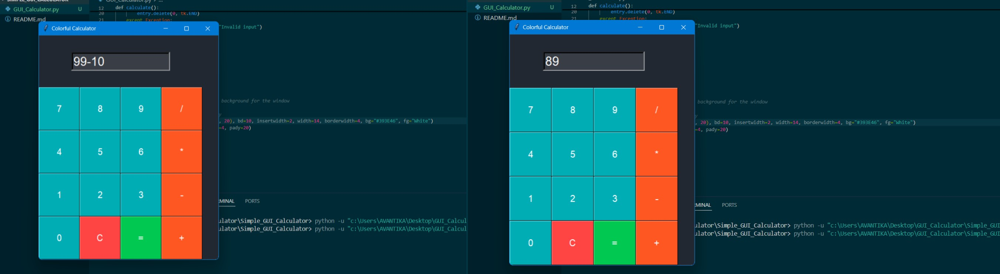
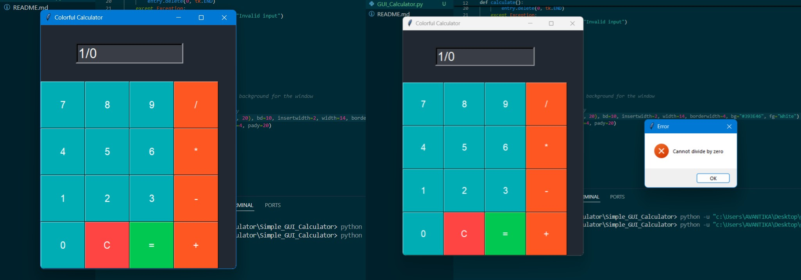

# Simple GUI Calculator

This project is a basic calculator application with a graphical user interface (GUI) built using Python's `tkinter` library. The calculator supports basic operations like addition, subtraction, multiplication, and division. It has a simple and user-friendly interface, designed to help users quickly perform calculations.

## Features

- **Basic Operations**: Supports addition, subtraction, multiplication, and division.
- **GUI Interface**: User-friendly layout using buttons and input fields.
- **Error Handling**: Handles basic input errors like division by zero.
- **Clear Button**: Easily reset the input for a new calculation.

## Technologies Used
- Python
- Tkinter
- GitHub Pages (for hosting project documentation)

## Usage
This Simple GUI Calculator allows you to perform basic arithmetic operations with an intuitive and colorful graphical interface. The calculator supports the following functions:
- **Basic Operations:** Perform addition (+), subtraction (-), multiplication (*), and division (/).
- **Clear Function:** Press the C button to clear the current input and start a new calculation.
- **Calculation Execution:** After entering an expression, press the = button to display the result in the input field.

## Screenshots

 
